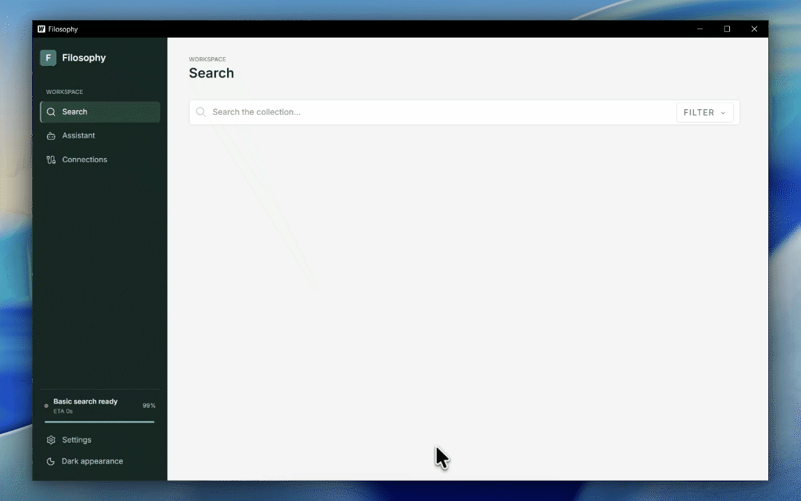

# Filosophy

Filosophy is a Windows desktop app for searching files stored on your computer. It combines filename and document-text search with locally computed text and image embeddings. Indexing and search do not require a hosted AI service. The optional Assistant can connect to a local or remote OpenAI-compatible provider when configured.



### Retrieval benchmark (Lexical vs Semantic vs Hybrid)

Filosophy's hybrid pipeline was benchmarked against the exact lexical ablation (production `Engine.Search` with semantics disabled) and pure semantic (dense vector similarity) baselines across 30 queries spanning exact names, keyword extraction, conceptual synonyms, typos, infix substrings, and noise suppression:

| Pipeline | NDCG@10 | Mean Recall@10 | MRR@10 | End-to-End Mean | p50 Latency | p95 Latency | Index-Only Latency |
| :--- | :---: | :---: | :---: | :---: | :---: | :---: | :---: |
| **Lexical Ablation** (Semantics Off) | 0.8380 | 86.67% | 0.8278 | 1.38 ms | 1.42 ms | 1.90 ms | 1.38 ms |
| **Pure Semantic** (Dense Vectors via StaticEmbedder) | 0.7436 | 83.33% | 0.7297 | **0.47 ms** | **0.45 ms** | **0.70 ms** | **0.43 ms** |
| **Filosophy Hybrid** (Production Engine.Search) | **0.8880** | **93.33%** | **0.8722** | 1.71 ms | 1.75 ms | 2.25 ms | 1.71 ms |

Hybrid retrieval achieves **93.33% Mean Recall@10** (a **+6.7 percentage point (pp)** gain over lexical ablation at 86.67%), outperforming pure semantic recall (83.33%) while delivering higher overall ranking quality (**0.8880 NDCG@10**, **0.8722 MRR@10**), particularly on conceptual synonyms (+0.0833 NDCG) and typo tolerance (+0.2000 NDCG). Verified against model weights SHA-256 `164fc63ee9...`. Full query logs, cryptographic verification, and failure mode analyses are documented in [EVALUATION.md](EVALUATION.md).

Run the benchmark locally:

```powershell
go test -v -run TestRetrievalEvaluation ./shared/...
# or via CLI:
go run ./cmd/eval
```

## Search and retrieval

Filosophy uses a staged, local hybrid retriever. The first indexing pass records eligible paths and metadata in SQLite, making filename and path keyword search available quickly. A background enhanced pass then extracts document text, chunks it, indexes it for full-text search, and writes text and image embeddings. Semantic matches become available as vectors are added; after the initial enhanced pass completes, the full hybrid index is ready. Search continues to combine keyword and semantic evidence rather than switching to semantic-only results.


Search gathers candidates from independent retrieval channels, then fuses their ranked lists:

- **Path and filename retrieval:** SQLite FTS matches exact terms, all query terms, prefixes, and substrings. Filename boosts and trigram similarity improve exact-name and typo-tolerant discovery.
- **Document-text retrieval:** Extracted chunks are searched with SQLite FTS5, including phrase and keyword signals; fuzzy content matching is used when exact retrieval returns few candidates.
- **Semantic retrieval:** A local text encoder retrieves related document chunks from the vector store, including conceptually similar passages that do not share query keywords. A text-to-image encoder retrieves relevant images through a separate, smaller candidate pool.

The ranked lists are combined with weighted Reciprocal Rank Fusion (RRF). RRF combines rank positions instead of adding raw BM25 and vector-similarity values, which have different score scales. Its smoothing constant limits how sharply a single rank position changes a channel's contribution. The default channel weights favor path matches (`3.0`) and path prefixes (`1.5`), with text semantics (`1.0`), image semantics (`1.1`), and content full-text (`1.0`) contributing complementary evidence.

Post-fusion adjustments keep results useful for real file discovery: strong filename matches and typo tolerance are boosted; path-only matches are capped so they do not outrank meaningful content matches; noisy system/binary files and generic code files are penalized; recency and query filters are applied; and results are sorted again. Code-file penalties are relaxed when the query closely matches extracted code content, so relevant source files can still rank well.

If the optional local cross-encoder is installed, it reranks the top eight fused candidates using up to two matching text excerpts per file. The reranker score is blended with the fused rank; candidates outside that reranking window retain their fused ordering. Embedding and reranking inference run locally.
### Candidate retrieval and ranking

## External downloads

Model and runtime bundles are not stored in this repository. Keep the downloaded directory structure intact when extracting into the repository root; the release packaging script validates required local assets but does not download them.

- **Models:** [Download the model bundle](https://drive.google.com/file/d/1-0Ctf13L4wO93oPXhkF2osZwN6ppDTJu/view?usp=sharing). It should provide the `text/` and `image/` directories, including their ONNX models and tokenizer files. The optional reranker files belong in the repository root.
- **libvips:** [Windows x64 releases](https://github.com/libvips/build-win64-mxe/releases/tag/v8.18.2). Download `vips-dev-x64-all-8.18.2.zip` and extract its `vips-dev-8.18/` directory into the repository root.
- **ONNX Runtime & DirectML:** Filosophy uses the DirectML execution provider for local GPU acceleration on any DirectX 12-compatible GPU (AMD, Intel, NVIDIA) without needing CUDA or cuDNN installations.
  - **GPU acceleration (recommended):** Download the [`Microsoft.ML.OnnxRuntime.DirectML`](https://www.nuget.org/packages/Microsoft.ML.OnnxRuntime.DirectML) package from NuGet (or direct [package download](https://www.nuget.org/api/v2/package/Microsoft.ML.OnnxRuntime.DirectML)). Open the `.nupkg` archive as a zip, extract `onnxruntime.dll` and `DirectML.dll` from `runtimes/win-x64/native/`, and place them beside the application executable (or in the repository root for development). When `DirectML.dll` is present, GPU acceleration is enabled automatically.
  - **CPU-only fallback:** Download the standard Windows x64 CPU release from [ONNX Runtime releases](https://github.com/microsoft/onnxruntime/releases) and place `onnxruntime.dll` beside the executable. If `DirectML.dll` is not present, the app automatically falls back to CPU execution.

## Build and run from source

The supported desktop build target is Windows x64. Install:

- Go 1.25.5 or later
- Node.js 20 or later with npm
- Wails CLI v2.16.0
- Rust and Cargo
- MSYS2 MinGW-w64 x64 GCC and binutils, including `x86_64-w64-mingw32-gcc` and `ar`
- The Microsoft WebView2 Runtime

Model and native runtime assets are distributed separately from this source repository and are not downloaded automatically. Download the assets below and extract them into the repository root before building or packaging.

```powershell
go mod download
./scripts/build-tokenizers.ps1
Push-Location frontend
npm ci
Pop-Location
wails dev
```

`wails dev` starts the desktop application and its Vite frontend. The UI alone can be previewed with `cd frontend; npm run dev`, but desktop features such as indexing and file opening require the Wails Go backend.

Build the frontend and Go application for release with:

```powershell
Push-Location frontend
npm ci
npm run build
Pop-Location
wails build
```

The executable is written to `build/bin/filosophy.exe`. To create a Windows zip from the staged runtime assets:

```powershell
./scripts/package-release.ps1 -Version 1.0.0
```

The script rebuilds the app, checks its required assets, and writes an archive under `dist/`. It does not fetch model files. Test the resulting archive on a clean Windows machine before publishing.

## Verify a source checkout

Run the Go tests and build:

```powershell
go test ./...
go build ./...
```

Build the frontend independently:

```powershell
Push-Location frontend
npm ci
npm run build
Pop-Location
```

## Project layout

- `main.go`, `frontend/`: Wails desktop application and UI
- `shared/`: indexing, extraction, query parsing, ranking, and local model inference
- `daemon/`, `cmd/`: background indexer and command-line entry points
- `api.go`, `mcp.go`: optional local REST and MCP endpoints
- `scripts/`: native tokenizer build and Windows release packaging
